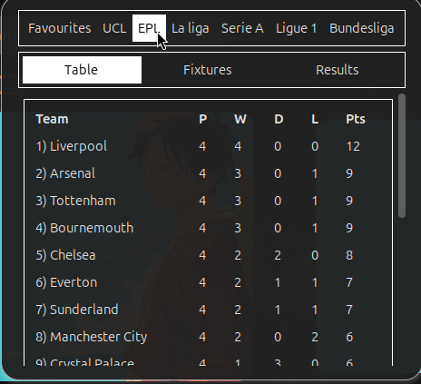

# FootBall-Track

Get Standings, Fixtures and results of UCL and top 5 leagues.

## How to install? 

Clone the repo and run 
```
./install.sh
```

or simply paste the following script in your terminal.

```
cd ~/.local/share/gnome-shell/extensions
git clone https://github.com/AbhishekTimalsina/Football-Track footballtrack@abhi.com
gnome-extensions enable footballtrack@abhi.com

```

## Screenshot





